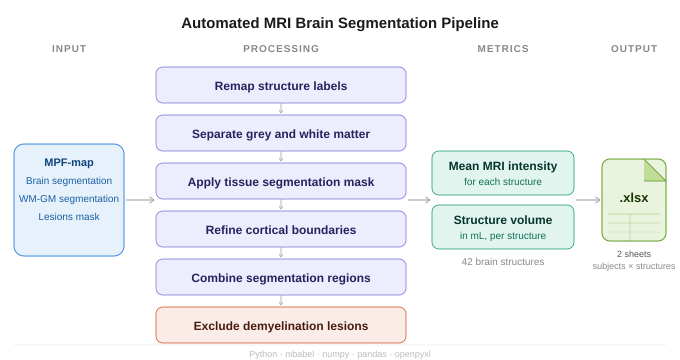

# MRI Segmentation Processing Pipeline

Automated pipeline for processing MRI brain segmentation data. The pipeline remaps structure labels, separates grey and white matter, removes demyelination lesions, and extracts quantitative metrics (mean intensity and volume) for each brain structure across a cohort of subjects.

---

## Graphical Abstract



---

## Repository Structure

```
├── process_all_folders_sctipt_en.py      # Per-folder segmentation processing script
├── segmentation_processor_en.py     # Main script: runs pipeline across all folders & saves results
├── input_example/               # Example input data (10 subjects)
│   ├── subject_01/
│   ├── subject_02/
│   └── ...
└── output_example/              # Example output files
    ├── subject_01/
    ├── subject_02/
    └── results_YYYYMMDD_HHMMSS.xlsx
```

---

## Input Data Format

Each subject has its own folder inside the input directory. The pipeline expects the following files per subject:

```
subject_01/
├── JHU_MNI_SS_WMPM_Type-III_MPF*.nii.gz    # Main segmentation atlas (60+ structures)
├── MPFuncor_coef_trim_seg.nii.gz            # Grey/white matter segmentation mask
├── MPFuncor_coef_transform.nii(.gz)         # Source MRI file (MPF map)
└── lesions.nii.gz                           # Demyelination lesions mask (optional)
```

### File Descriptions

| File | Description | Required |
|------|-------------|----------|
| `JHU_MNI_SS_WMPM_Type-III_MPF*.nii.gz` | Main brain atlas segmentation file containing 44 labelled structures (labels 2–66). Used as the structural reference for all metric extraction. | ✅ Yes |
| `MPFuncor_coef_trim_seg.nii.gz` | Binary tissue segmentation mask distinguishing grey matter (label 2) and white matter (label 3). Used to refine cortical structure boundaries. | ✅ Yes |
| `MPFuncor_coef_transform.nii(.gz)` | Source MRI quantitative map (e.g. MPF — Macromolecular Proton Fraction). Intensity values from this file are used to compute per-structure mean intensity. | ✅ Yes |
| `lesions.nii.gz` | Binary mask of demyelination lesion voxels. If present, lesion voxels are zeroed out from the final combined segmentation before metric extraction. | ⬜ Optional |

> **Note:** The pipeline uses flexible filename matching with glob patterns, so minor filename variations (e.g. `MPFuncor_transform.nii`, `MPFuncor_coef_transform.nii.gz`) are handled automatically. See `process_all_folders_sctipt_en.py` for the full list of accepted patterns.

---

## Output Files

### Per-subject intermediate files

Each subject folder will contain the following files after processing:

```
subject_01/
├── remapped.nii.gz                  # Atlas with remapped label order (labels 14–19 ↔ 24–29 swapped)
├── remapped_GM.nii.gz               # Grey matter structures only (labels 1–19)
├── remapped_WM.nii.gz               # White matter structures only (labels 20+)
├── processed_mask.nii               # Recoded tissue mask (2→1 GM, 3→2 WM)
├── segmented_cortex.nii             # WM atlas multiplied by tissue mask
└── combined_result.nii.gz           # Final segmentation: GM + segmented cortex, lesions removed
```

| File | Description |
|------|-------------|
| `remapped.nii.gz` | Atlas after label remapping: labels 14–19 and 24–29 are swapped to align subcortical and cortical structure order. |
| `remapped_GM.nii.gz` | Grey matter mask extracted from remapped atlas (labels 1–19). |
| `remapped_WM.nii.gz` | White matter mask extracted from remapped atlas (labels 20+). |
| `processed_mask.nii` | Tissue segmentation mask recoded to binary tissue classes (GM=1, WM=2). |
| `segmented_cortex.nii` | Cortical white matter regions refined by the tissue mask (element-wise multiplication). |
| `combined_result.nii.gz` | Final segmentation combining GM structures and segmented cortex, with demyelination lesion voxels zeroed out. This is the file used for metric extraction. |

### Results spreadsheet

A single Excel file `results_YYYYMMDD_HHMMSS.xlsx` is saved to the output folder, containing two sheets:

| Sheet | Contents |
|-------|----------|
| `Mean_Intensity` | Mean MRI intensity per structure per subject. Rows = subjects, columns = brain structures. |
| `Volume_mL` | Volume (mL) per structure per subject. Rows = subjects, columns = brain structures. |

Service labels (Label 30, Label 60) are excluded from both sheets. All 42 named structures are listed as columns in the anatomical order defined in `segmentation_processor_en.py`.

#### Example output (Mean_Intensity sheet)

| folder | Caudate_L | Caudate_R | Putamen_L | Putamen_R | Thalamus_L | ... | Cerebellum_R_WM |
|--------|-----------|-----------|-----------|-----------|------------|-----|-----------------|
| subject_01 | 0.142 | 0.139 | 0.118 | 0.121 | 0.156 | ... | 0.089 |
| subject_02 | 0.138 | 0.141 | 0.122 | 0.119 | 0.149 | ... | 0.091 |
| subject_03 | 0.151 | 0.148 | 0.131 | 0.128 | 0.162 | ... | 0.094 |

---

## Brain Structures

The pipeline extracts metrics for the following 42 structures:

| Label | Structure | Label | Structure |
|-------|-----------|-------|-----------|
| 2 | Caudate_L | 3 | Caudate_R |
| 4 | Putamen_L | 5 | Putamen_R |
| 6 | Thalamus_L | 7 | Thalamus_R |
| 8 | Globus_pallidus_L | 9 | Globus_pallidus_R |
| 10 | Hippocamp_L | 11 | Hippocamp_R |
| 12 | Amigdala_L | 13 | Amigdala_R |
| 14 | Corpus_callosum | 15 | Fornix |
| 16 | Brainstem | 17 | Pons |
| 18 | Substantia_nigra_L | 19 | Substantia_nigra_R |
| 20 | Occipital_cortex_L_GM | 21 | Occipital_cortex_R_GM |
| 22 | Parietal_cortex_L_GM | 23 | Parietal_cortex_R_GM |
| 24 | Insular_cortex_L_GM | 25 | Insular_cortex_R_GM |
| 26 | Temporal_cortex_L_GM | 27 | Temporal_cortex_R_GM |
| 28 | Frontal_cortex_L_GM | 29 | Frontal_cortex_R_GM |
| 32 | Cerebellum_L_GM | 33 | Cerebellum_R_GM |
| 40 | Occipital_cortex_L_WM | 42 | Occipital_cortex_R_WM |
| 44 | Parietal_cortex_L_WM | 46 | Parietal_cortex_R_WM |
| 48 | Insular_cortex_L_WM | 50 | Insular_cortex_R_WM |
| 52 | Temporal_cortex_L_WM | 54 | Temporal_cortex_R_WM |
| 56 | Frontal_cortex_L_WM | 58 | Frontal_cortex_R_GM |
| 64 | Cerebellum_L_WM | 66 | Cerebellum_R_WM |

---

## Installation

```bash
pip install nibabel numpy pandas openpyxl
```

Python 3.8+ is required.

---

## Usage

Run the main script and follow the interactive prompts:

```bash
python segmentation_processor_en.py
``

You will be asked for three paths:

```
Enter path to data folder:       <path to folder containing subject subfolders>
Enter path to processing script: <path to process_all_folders_sctipt_en.py>
Enter path to save results:      <path to output folder, or Enter to save next to data>
```

Then select a mode:

```
SELECT MODE:
1 - Test on a single folder
2 - Process all folders
```

> **Tip (Windows):** You can paste paths directly from File Explorer using *Copy as path* — surrounding quotes are stripped automatically.

---

## Pipeline Steps

For each subject folder, `process_all_folders_sctipt_en.py` performs the following steps:

```
Step 1 — Remap labels      Swap labels 14–19 ↔ 24–29 in the main atlas
Step 2 — Split GM / WM     Separate grey matter (1–19) and white matter (20+)
Step 3 — Process mask      Recode tissue mask: GM label 2→1, WM label 3→2
Step 4 — Multiply          WM atlas × tissue mask → segmented cortex
Step 5 — Combine           segmented cortex + GM atlas → combined segmentation
Step 6 — Remove lesions    Zero out demyelination lesion voxels (if file present)
```

After all folders are processed, `segmentation_processor_en.pyy` extracts mean intensity and volume per structure and saves the results to Excel.

---

## Notes

- If a subject folder is missing an optional lesions file, step 6 is skipped and a warning is printed.
- If voxel dimensions differ between files, arrays are cropped to the minimum shared shape.
- If duplicate structure entries are detected (e.g. due to label overlap), the mean value is used.
- Processing timeout per folder is 5 minutes; increase `timeout=300` in `run_segmentation_script()` if needed for large volumes.
